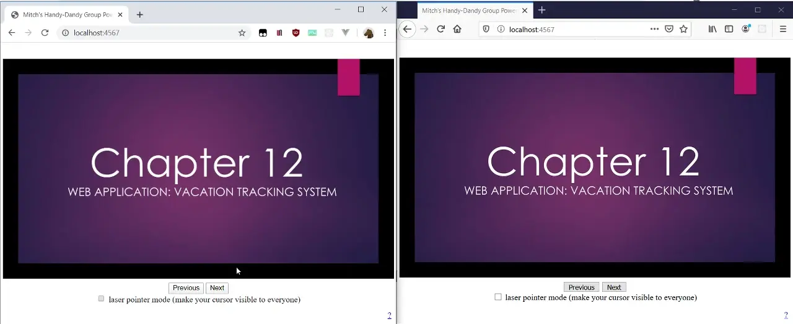

# Mitch's Handy-Dandy Multi-User Slide Presenter.
This web app lets multiple people share control of a slideshow as it is presented. It works by turning a PDF file containing your slides into a series of PNG files that can be easily displayed through your web browser (using the pdftocairo utility, which must be on your PATH) and then setting up a simple SocketIO-based web page interface with which the presentation can be controlled by any of the presenters at any given point; you can also broadcast your cursor's position, and it will look like a laser pointer.

## Use:
Add a pdf containing slides to the /slides directory, start the program, and navigate to localhost:4567 in your browser.

### Limitations:
Right now it only displays the last presentation it happens to load from the /slides folder; you can only move through the slides one at a time; because of the simple nature of the slide-displaying technique, slide transitions and animations are not supported. It's also not currently set up to recognize a new presentation if it has the same filename as an old one. Some of these things might get addressed in the future, who knows.

### Demo:

